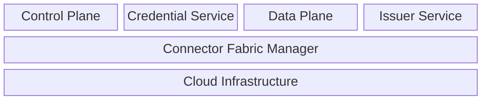
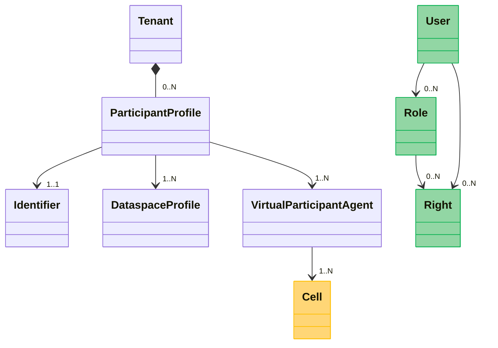
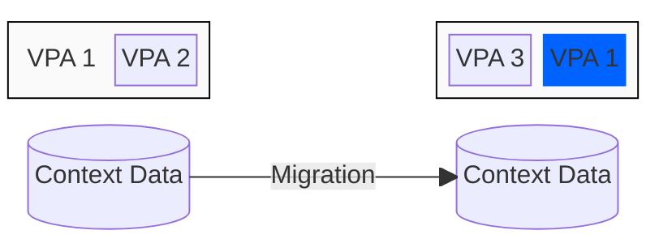

# CFM System Architecture

## Introduction

This document defines the overall system architecture for the Connector Fabric Manager (CFM). The CFM is a platform that
provides multitenancy capabilities to the following dataspace services:

- A Control Plane, which manages data sharing operations (including catalog publication, contract
  negotiation, and transfer control)
- One or more Data Planes that perform data transmission
- A Credential Service that manages a participant's DID artifacts, store credentials, and create Verifiable
  Presentations
- An Issuer Service for entities and participants that issue Verifiable Credentials.

Dataspace services do not operate in isolation. They collaborate with cloud services (for example, a vault for secure
storage and load-balancers for network routing) and other networking infrastructure. The CFM orchestrates these layers
and provides the isolation necessary for efficient and secure multitenant operation. The CFM is represented by the
following logical architecture:

**Logical Systems Architecture**

The CFM is composed of three subsystems:

- The **Tenant Manager (TM)** which manages tenancy data and initiates deployment processes.
- The **Provision Manager (PM)** which executes stateful orchestrations that configure services and
  infrastructure for participants.
- **Activity Agents** that execute tasks specified by the Provision Manager

The CFM is designed as a reliable message-based system that can be extended and deployed to diverse cloud and on-premise
environments. Its design is simple; at a minimum it requires only a Postgres database and messaging system (NATS is the
default).

## Multitenancy and Service Virtualization

The system architecture is based on the concept of ***service virtualization***: a single software deployment can enable
an isolation environment to process requests for different participants and dataspace contexts. We use the term
virtualization over multitenancy for several reasons. First, multitenancy is too ambiguous and has been used to denote
different architectures. More importantly, multitenancy does not accurately describe the architecture this document lays
out. As we will see, while individual services have the concept of an isolation context, it does not directly map to the
concept of a "tenant." Instead, tenant management is externalized from core dataspace services and managed by the CFM.

## Service Virtualization Model

Service virtualization is based on the following model:

**Virtualization Model**

A **Tenant** represents an organization or entity that participates in one or more dataspaces. A tenant has one or more
**Participant Profiles.** Each profile is associated with an **Identifier**, at least one **Dataspace Profile**, and at
least one **Virtual Participant Agent (VPA)**.

A Dataspace Profile includes a set of interoperable policies and DSP protocol version.

A Virtual Participant Agent is a unit of administrative control and deployment. A VPA targets a **cell**.

A **User** performs management operations against a VPA using an RBAC model based on **roles** and **rights**.

The service virtualization layers in the control plane and data plane implement runtime isolation for each VPA.
Importantly, they do not contain the concept of a tenant; the CFM orchestrator manages tenants.

The control and data planes use the VPA as the unit of runtime isolation. However, the services are loosely coupled
through the [Data Plane Signaling Protocol](). As will be detailed later, control plane and data plane deployments are
typically remote and mapped by participant profile.

#### The Participant Profile

A dataspace has an overriding constraint:

> A participant has one and only one identifier

Note that this does not mean an organization (e.g., a legal entity) must have exactly one identifier. Rather, if an
organization has multiple identifiers, it must either be mapped to a single identity (e.g., DID) or the organization
must have multiple participants.

Let's break down several different virtualization scenarios based on this using a fictitious organization, Acme
Industries.

##### One identity per dataspace

In this scenario, Acme uses one DID per dataspace. This results in a participant profile per dataspace since the
identifiers used for each dataspace are different.

##### One identity, multiple dataspaces

In this scenario, Acme uses a single DID across multiple dataspaces, resulting in a single participant profile for all
dataspaces.

#### Virtual Participant Agents

A VPA defines a runtime context deployed when a participant profile is provisioned. Let's consider a simple case where
Acme participates in one dataspace. Returning to the logical systems architecture, VPAs for the control plane,
credential service, and data plane(s) will be provisioned. This results in the creation of three VPA *types*:

- A Credential Service VPA
- A Control Plane VPA
- A Data Plane VPA

Multiple VPAs of the same type may also be deployed. For example, Acme may want to share streaming data and access to an
API, which are served through different data planes. In this case, two VPAs will be created, one for each data plane.

VPAs are linked through network, transport, and application security layers. As will be detailed further, a control
plane and data plane VPA may rely on a VPN, TLS, and OAuth tokens for secure communications.

##### Cell Targeting

VPAs are targeted to a *cell*, which is a homogenous deployment zone. A cell could be a Kubernetes cluster or some other
infrastructure. Cells are responsible for their own scaling. For example, a Kubernetes-based cell may use an autoscaling
system such as [Keda](https://keda.sh/) to add capacity dynamically.

##### RBAC: Users, Roles, and Rights

> TODO: This section will be further developed as requirements evolve.

A **User** represents an administrator who can perform a set of actions against subsystems. Users have a set of **Rights
** and/or are assigned **Roles**.

## Context Isolation Architecture

The virtualization model we have outlined is realized across multiple services through runtime context isolation. A
guiding principle is that this isolation is ***configuration-based***, not _**process-based**_. A process-based
architecture achieves isolation based on runtime segmentation. For example, a VPA following this approach would spin up
a set of operating system processes such as control plane, data plane, and database instances. This is not scalable or
efficient. Instead, a configuration-based isolation architecture involves writing VPA metadata to a persistent store.
This metadata is used by shared services that create inexpensive isolation contexts on the fly when requests are
received and processed. This provides efficient service utilization and makes context migration relatively easily - move
the VPA metadata to a different cell and update request routing configuration.

**Configuration-Based Architecture**

To implement this architecture, each service will provide APIs for creating, updating, and deleting VPA metadata. We now
turn to how these services support this virtualization model.

## CFM Subsystems

The CFM consists of multiple subsystems: the Tenant Manager, the Provision Manager, and Activity Agents. The CFM
platform is designed as a message-based system built on an extensible messaging middleware for reliable, asynchronous
communication. This architecture enables temporal and spatial decoupling between independent subsystems, allowing them
to operate autonomously without direct dependencies.

### NATS Jetstream

The default messaging middleware is [NATS Jetstream](https://docs.nats.io/nats-concepts/jetstream), which provides
persistence, durability, and guaranteed delivery. Messages are published to named
subjects and persisted in streams, ensuring no message loss even if consumers are temporarily unavailable. This
reliability is essential for orchestration workflows that may span multiple stages and infrastructure environments.

### System Modularity: The Service Assembler

The `ServiceAssembler` is the core modularity system that composes CFM runtimes from discrete modules. The assembler
enables the decomposition of system functionality into self-contained modules, or `service assemblies`, that declare
their dependencies and provided services.

Each service assembly implements the `ServiceAssembly` interface, which defines:

- **Name**: A unique identifier for the component
- **Provides**: The set of service types or capabilities this component exports and makes available to other assemblies
- **Requires**: The set of service types or capabilities this component depends on from other assemblies
- **Lifecycle operations**: `Init`, `Prepare`, `Start`, `Finalize`, and `Shutdown` sequences for coordinated component
  initialization and teardown

#### Assembly Loading and Service Resolution

The `ServiceAssembler` manages the registration, dependency resolution, and initialization of service assemblies when
the system boots:

1. **Registration**: All assemblies are registered with the assembler. Each assembly declares the services it provides
   and the services it requires.

2. **Dependency Analysis**: The assembler constructs a directed acyclic graph based on the `Provides` and `Requires`
   declarations
   from all registered assemblies. This graph represents the relationships between service requirements and their
   providers.

3. **Topological Ordering**: The dependency graph is sorted topologically, ensuring assemblies are initialized in an
   order that satisfies all dependency constraints. This ordering determines the sequence in which assemblies transition
   through their lifecycle phases.

4. **Service Registry**: During the initialization phase, each assembly receives an `InitContext` containing a
   `ServiceRegistry`. Assemblies use this registry to:
    - Register concrete service instances they provide
    - Resolve and retrieve service instances provided by other assemblies
    - Share cross-cutting concerns and shared infrastructure

5. **Lifecycle Coordination**: Assemblies transition through their lifecycle stages in dependency order:
    - **Init**: Assemblies register their services in the registry and perform initialization logic
    - **Prepare**: Assemblies perform secondary setup after all services are registered
    - **Start**: Assemblies begin active operations
    - **Finalize**: Assemblies perform cleanup before shutdown
    - **Shutdown**: Assemblies perform final resource cleanup and termination

This dependency-driven approach ensures that services are always initialized in order and that all required
dependencies are available when an assembly boots.

#### Modular Architecture

The system uses a structured module layout organized by concern and functionality. Shared functionality is centralized
in the `/common` module, which provides cross-cutting utilities including:

- Collection abstractions and data structure implementations
- DAG (Directed Acyclic Graph) implementation used for topological dependency ordering
- Storage abstraction layers (memory and SQL-backed implementations)
- Message client integrations (NATS)
- Query and handler implementations
- Type definitions and runtime models

The `/assembly` module contains shared service assemblies that implement the core CFM functionality. These assemblies
are organized by subsystem and provide capabilities such as an HTTP client, HTTP request routing, and a Vault client.

#### Service Type Registry

Services are identified using `ServiceType` keys, which provide a type-safe mechanism for service discovery and
resolution. These keys decouple assembly implementations from direct dependencies on concrete types. When an assembly
requires a service, it specifies the required `ServiceType`, and the registry resolves the actual implementation at
runtime. This allows for multiple implementations of the same service interface to coexist in different deployment
configurations.

### Tenant Manager

The Tenant Manager implements the CFM service virtualization model and provides a REST API for executing operations that
modify resources. Virtualization model entities are persisted with extensible properties that can be queried using the
CFM predicate-based query language.

When the Tenant Manager provisions or disposes resources, it sends message requests to the Provision Manager, which
asynchronously notifies the Tenant Manager when processing is completed.

### Provision Manager

The Provision Manager implements asynchronous orchestration by executing stateful workflows defined through
`OrchestrationDefinition` entities. The provisioning and orchestration architecture is
described [here](./provisioning/orchestrator.design.md).

### Activity Agents

Activity agents asynchronously process orchestration steps by receiving messages sent by the Provision Manager. Agents
are temporally and spatially decoupled from the provisioner through NATS. Agents isolate infrastructure secrets and
access from the provisioning manager. This results in bounded security contexts, even within an orchestration.